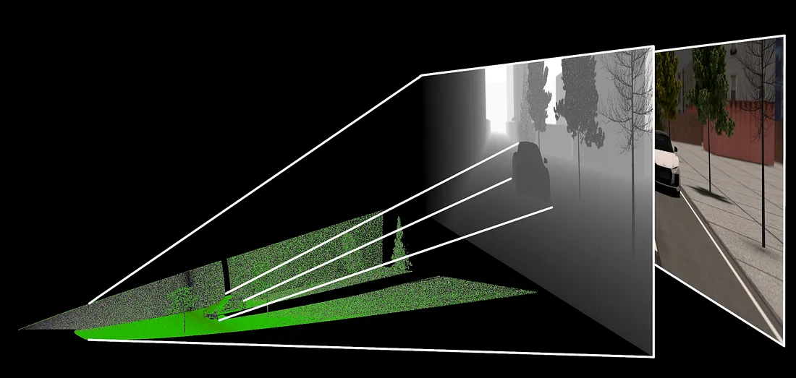
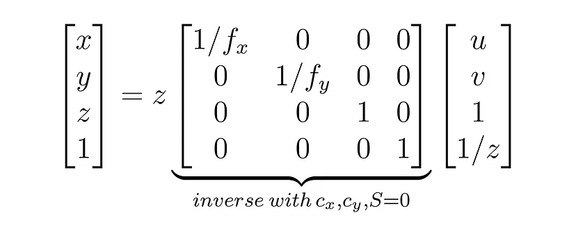
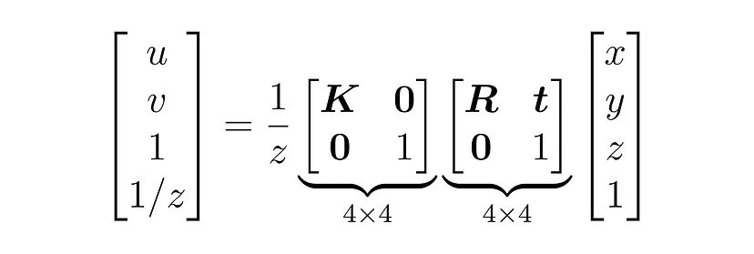

# depth2pointcloud

#### 介绍
一个为了加速深度图转换为点云的python demo.该程序主要聚焦多线程/协程、向量化加速等技术精进。当然实际中最好是C based，但是有时，算法比语言更重要！大不了写个C再写个binding

### 0.9->0.003s，定内参、无畸变、定长宽下加速了300+倍
#### 目录

---

---

#### 参与贡献

1.  Fork 本仓库
2.  新建 Feat_xxx 分支
3.  提交代码
4.  新建 Pull Request
